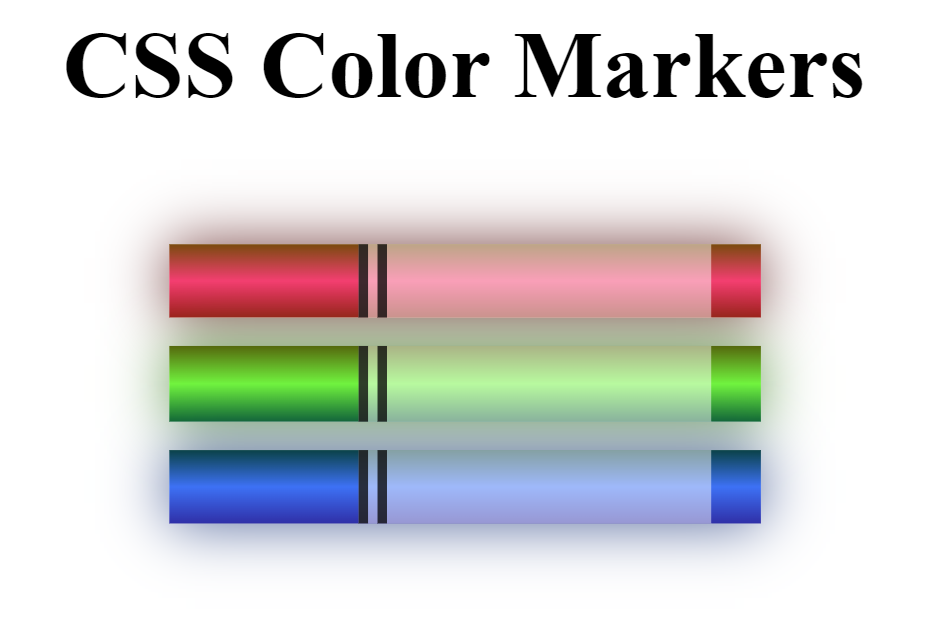

# CSS Color Markers



This project demonstrates how to create colorful marker illustrations using only HTML and CSS. The markers are designed with gradient backgrounds, shadows, and rounded edges to give them a realistic look.

## Features

- **Pure CSS Design:** No images or external libraries used.
- **Gradients and Shadows:** CSS gradients and shadows create a three-dimensional effect.
- **Customizable:** Easily change the colors, sizes, and styles of the markers.

## Usage

To use these CSS markers in your project:

1. Clone this repository:
   ```bash
   git clone https://github.com/kushal6463/Marker.git

